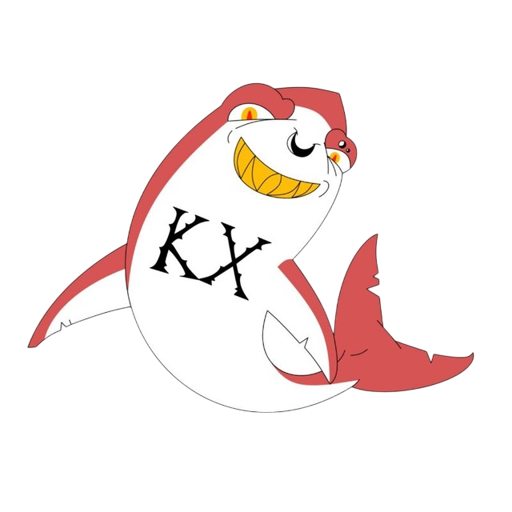
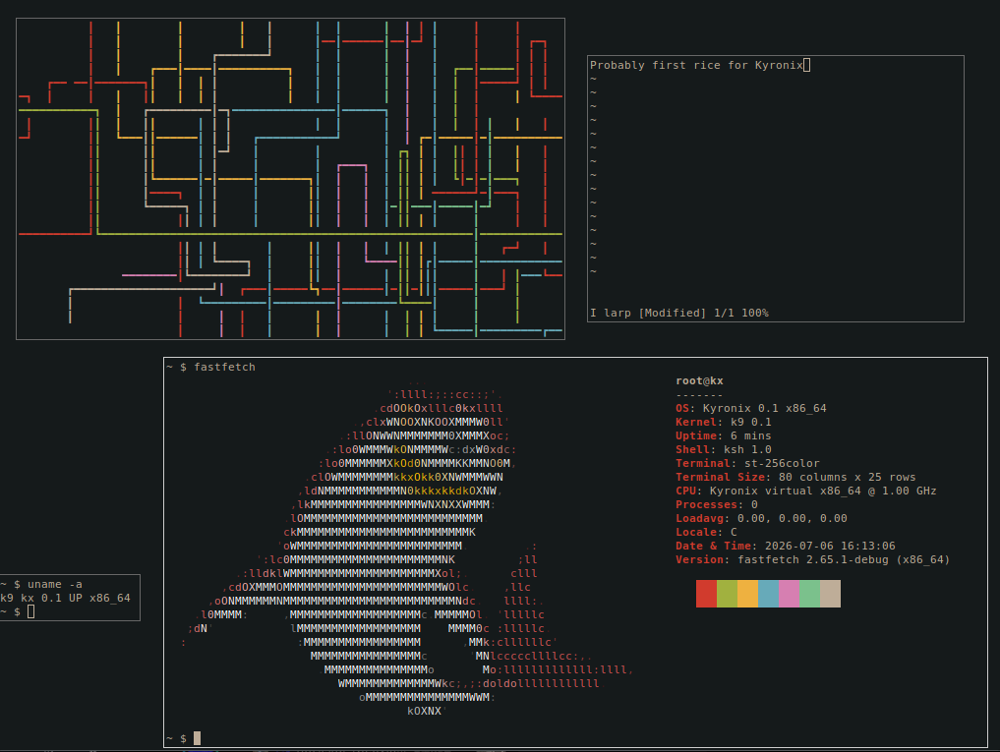

# Kyronix



Operating system that sucks less.


[](https://github.com/kyronix-project/kyronix/actions/workflows/test.yml)
[](#)
[](#)
[](#)

<br clear="left"/>

Kyronix is a modern hybrid operating system focused on
performance, security and stability.



## Features

### Kernel
- x86-64, 4-level paging, SMEP, NX-bit
- Limine bootloader (BIOS + UEFI)
- Preemptive scheduler (~1000 Hz)
- ELF64 loader (PIE + musl)
- 150+ Linux-compatible syscalls
- Demand paging (`mmap`, `mprotect`, `mremap`, `brk`)
- RTC, CPUID, RDRAND

### Drivers
- Framebuffer console (PSF fonts)
- PS/2 keyboard & mouse
- PCI enumeration
- AHCI (SATA)
- virtio-net
- Serial console (COM1)
- evdev (`/dev/input/event*`)
- Virtual terminals
- UIO

### Filesystems
- POSIX VFS
- CPIO initramfs
- Ext2 (R/W)
- FAT32 (R/W)
- procfs, devfs
- eventfd, pipe, AF_UNIX sockets

### Networking ([LwIP](https://github.com/stm32duino/lwip))
- ARP, IPv4, ICMP, UDP, TCP
- DHCP client
- AF_INET socket API
- ping, wget, nc

### Userspace
- **ksh** shell
- **vi** text editor
- **kyrobox** POSIX utilities
- **login** authentication
- **pkg** package manager
- Runs musl-linked applications

### Advanced
- POSIX signals
- `clone()` threads
- Jails (FS/PID/IPC isolation)
- Shared memory
- futex
- epoll, poll, select
- Continuous integration test suite

## Build

### Dependencies

```sh
gcc musl-tools qemu-system xorriso nasm
```

### Quick start

```sh
make clean && make all && make run
```

Without graphics:

```sh
make clean && make all && make run-serial
```

### Make targets

| Target | Description |
|---------|-------------|
| `all` | Build everything |
| `iso` | Build ISO image |
| `run` | Launch in QEMU |
| `run-serial` | Launch with serial console |
| `test-run` | Run tests |
| `test-run-log` | Run tests with logging |
| `user-build` | Build userspace |
| `fmt` | Format source |
| `fmt-check` | Check formatting |
| `clean` | Remove build artifacts |

## Project structure

| Directory | Purpose |
|-----------|---------|
| `kernel/` | Kernel source |
| `user/` | Userspace |
| `rootfs/` | Initramfs |
| `limine/` | Bootloader |
| `meta/` | Assets & screenshots |

## Support

If you like Kyronix, consider supporting its development.

<a href="https://buymeacoffee.com/kyron1x">
  
</a>

## License

Distributed under the ISC License. See `LICENSE` for more information.
